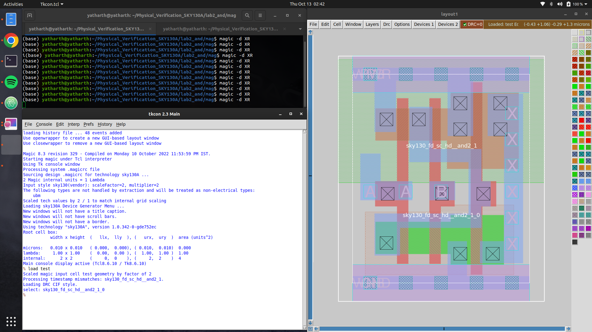
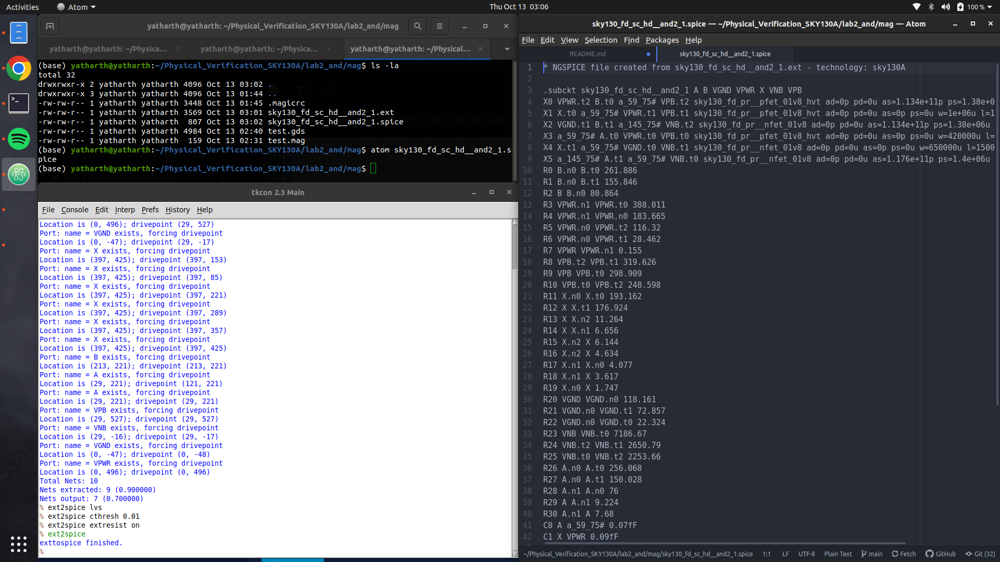
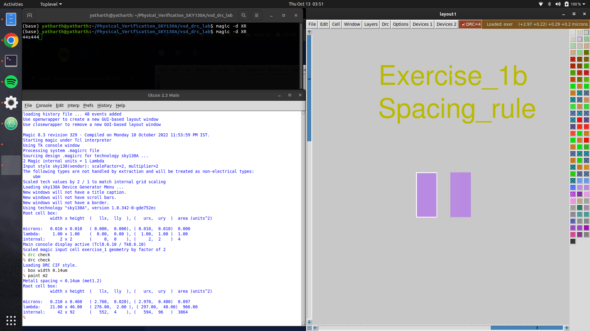
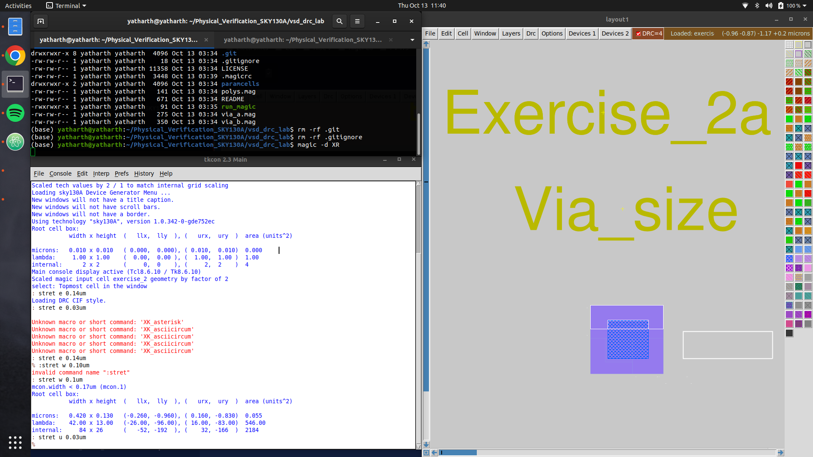
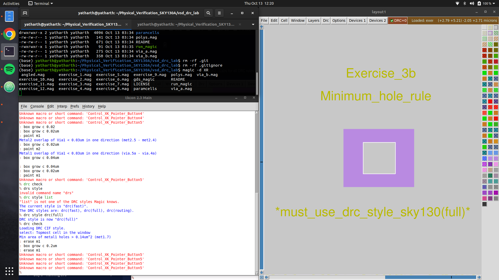
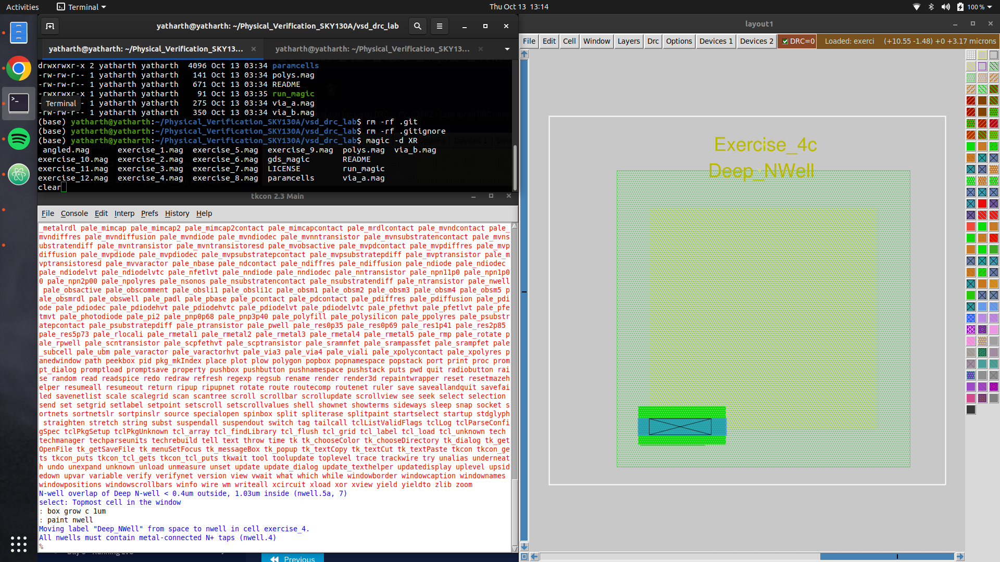
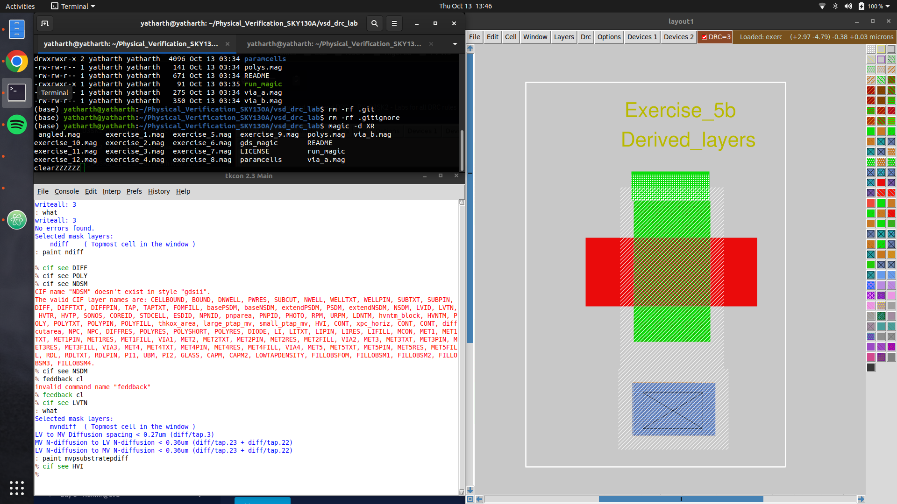

# Physical_Verification_SKY130A

## About the project

## Index

## Chapter 0 - Getting the tools

To adequetly utilize the open source skywater130 pdk and understand the design flow we first require to install all the tools, which are
- open_pdk
- magic
- ngspice
- xschem
- netgen


*Note: open_pdk has to be installed last so it can correctly associate the xschem and magic directories.*

### Magic
Magic is an open source VLSI layout tool.<br />
Install steps
```
$  git clone git://opencircuitdesign.com/magic
$  cd magic
$	 ./configure
$  make
$  sudo make install
```
More info can be found at: [http://opencircuitdesign.com/magic/index.html](http://opencircuitdesign.com/magic/index.html)

### Netgen
Netgen is a tool for comparing netlists, a process known as LVS, which stands for "Layout vs. Schematic" <br /><br />
Install steps:
```
$  git clone git://opencircuitdesign.com/netgen
$  cd netgen
$	./configure
$  make
$  sudo make install
```
More info can be found at: [http://opencircuitdesign.com/netgen/index.html](http://opencircuitdesign.com/netgen/index.html)

### Xschem
Xschem is a schematic capture program <br /><br />
Install steps:
```
$  git clone https://github.com/StefanSchippers/xschem.git xschem_git
$	./configure
$  make
$  sudo make install
```
More info can be found at: [http://repo.hu/projects/xschem/index.html](http://repo.hu/projects/xschem/index.html)

### Ngspice
ngspice is the open source spice simulator for electric and electronic circuits.<br /><br />
Install steps:<br />

After downloading the tar ball from [https://sourceforge.net/projects/ngspice/files/](https://sourceforge.net/projects/ngspice/files/) to a local directory unpack it using:
```
 $ tar -zxvf ngspice-37.tar.gz
 $ cd ngspice-37
 $ mkdir release
 $ cd release
 $ ../configure  --with-x --with-readline=yes --disable-debug
 $ make
 $ sudo make install
```
More info can be found at: [https://ngspice.sourceforge.io/index.html](https://ngspice.sourceforge.io/index.html)

Please note that to view the simulation graphs of ngspice, xterm is required and can be installed using
```
$ sudo apt-get update
$ sudo apt-get install xterm
```

### open_pdk

Open_PDKs is distributed with files that support the Google/SkyWater sky130 open process description [https://github.com/google/skywater-pdk](https://github.com/google/skywater-pdk). Open_PDKs will set up an environment for using the SkyWater sky130 process with open-source EDA tools and tool flows such as magic, qflow, openlane, netgen, klayout, etc.<br /><br />
Install steps:
```
$  git clone git://opencircuitdesign.com/open_pdks
$  open_pdks
$	./configure --enable-sky130-pdk
$  make
$  sudo make install
```

Now that we have all the required tools installed lets get started with understanding the design flow!
## Chapter 1 - Understanding the design flow

### Verifiying the open_pdk installation

### Creating inverter schematic using xschem

### Creating and simulating testbench Schematic

### Creating inverter layout in Magic and exporting its netlist

### Performing LVS checks on testbench and layout netlists

## Chapter 2 - DRC and LVS

### Design Rule Checking (DRC)
Make sure design layout meets all silicon foundry rules for masks.

### Layout vs. Schematic (LVS)
Make sure design layout matches a simulatable netlist by electrical connectivity and devices.


### GDSII file format

### Reading GDS files

```
$ cp /usr/local/share/pdk/sky130A/libs.tech/magic/sky130A.magicrc ./.magicrc
```

```
% gds read /usr/local/share/pdk/sky130A/libs.ref/sky130_fd_sc_hd/gds/sky130_fd_sc_hd.gds
% load sky130_fd_sc_hd__and2_1
```


```
% cif istyle sky130(vendor)
% gds read /usr/local/share/pdk/sky130A/libs.ref/sky130_fd_sc_hd/gds/sky130_fd_sc_hd.gds
```


```
% gds noduplicates true
```


### Matching ports to spice netlists

```
% port first
% port 1 name
% port 1 class
% port 1 use
```


```
% lef read /usr/local/share/pdk/sky130A/libs.ref/sky130_fd_sc_hd/lef/sky130_fd_sc_hd.lef
```


```
% readspice /usr/local/share/pdk/sky130A/libs.ref/sky130_fd_sc_hd/spice/sky130_fd_sc_hd.spice
% load sky130_fd_sc_hd__and2_1
```


### Abstract views

Note: difference between load and getcell

The difference is between a cell and an instance of that cell.
If you do load inverter, then you will be editing the cell called inverter.
If you do getcell inverter, then you will place an instance of the cell inverter inside the cell you're currently editing.

```
% lef read /usr/local/share/pdk/sky130A/libs.ref/sky130_fd_sc_hd/lef/sky130_fd_sc_hd.lef
% load sky130_fd_sc_hd__and2_1
% readspice /usr/local/share/pdk/sky130A/libs.ref/sky130_fd_sc_hd/spice/sky130_fd_sc_hd.spice
% load test
% getcell sky130_fd_sc_hd__and2_1
% gds write test     
```


Restart magic to get broken thing
```
%gds read test
%save test
```


When test is reloaded after saving we get the original layout
```
% load test
% gds write test
```
We can edit the cell by making it editable
```
% property
% cellname writeable sky130_fd_sc_hd__and2_1 true
% gds write test
```


and after restarting magic and reloading it we still get an unchanged cell
```
% gds read test
```



### Extraction
```
% extract all
% ext2spice lvs
% ext2spice
```

```
% ext2spice cthresh 0.01
% ext2spice
```


```
% ext2sim labels on
% ext2sim

% extresist tolerance 10
% extresist

% ext2spice lvs
% ext2spice cthresh 0.01
% ext2spice extresist on
% ext2spice
```



### DRC

/usr/local/share/pdk/sky130A/libs.tech/magic/run_standard_drc.py /usr/local/share/pdk/sky130A/libs.ref/sky130_fd_sc_hd/mag/sky130_fd_sc_hd__and2_1.mag

% drc style drc(full)
% drc check
% drc why
% drc find

% getcell sky130_fd_sc_hd__tapvpwrvgnd_1

### LVS

cp /usr/local/share/pdk/sky130A/libs.tech/netgen/sky130A_setup.tcl ./setup.tcl

netgen -batch lvs "../mag/sky130_fd_sc_hd__and2_1.spice sky130_fd_sc_hd__and2_1" "/usr/local/share/pdk/sky130A/libs.ref/sky130_fd_sc_hd/spice/sky130_fd_sc_hd.spice sky130_fd_sc_hd__and2_1"

### XOR

% flatten -nolabels xor_test
% xor -nolables xor_test
% load xor_test


## Chapter 3 - DRC Issues
Usefull Magic commands
- b
- s
- ?
- : box width 0.14um
- : stret u 0.14um
- : move e 0.14um
- : box grow c 0.01um
- : paint m1

### width_rule

### spaceing_rule

### wide_spacing_rule

### notch_rule

### via_size

### multiple_vias

### via_overlap

### auto_generate_via

### minimum_area_rule

### minimum_hole_rule

### wells

### deep_nwell

### automatic_deep_nwell

### derived_layers

### derived_layer_high_voltage

### derived_layers_automatic_layers


## Chapter 4 - LVS

## Additional Content - OpenLane Design Flow
