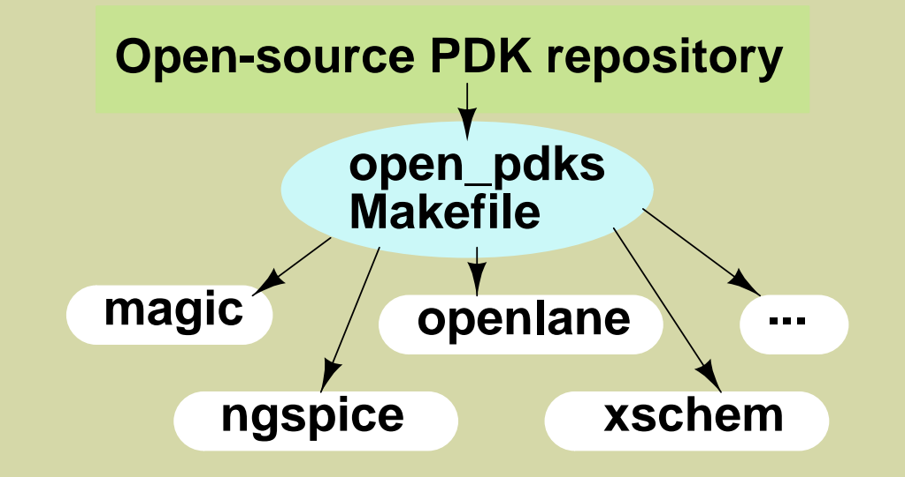

# Physical_Verification_SKY130A

## About the project

## Index

## Chapter 0 - Getting the tools

To adequetly utilize the opensourse skywater130 pdk and understand the design flow we first require to install all the tools, which are
- open_pdk
- magic
- ngspice
- xschem
- netgen


*Note: open_pdk has to be installed last so it can correctly associate the xschem and magic directories.*

### Magic
Magic is an open source VLSI layout tool.<br />
Install steps
```
$  git clone git://opencircuitdesign.com/magic
$  cd magic
$	 ./configure
$  make
$  sudo make install
```
More info can be found at: [http://opencircuitdesign.com/magic/index.html](http://opencircuitdesign.com/magic/index.html)

### Netgen
Netgen is a tool for comparing netlists, a process known as LVS, which stands for "Layout vs. Schematic" <br />
Install steps
```
$  git clone git://opencircuitdesign.com/netgen
$  cd netgen
$	./configure
$  make
$  sudo make install
```
More info can be found at: [http://opencircuitdesign.com/netgen/index.html](http://opencircuitdesign.com/netgen/index.html)

### Xschem
Xschem is a schematic capture program <br />
Install steps
```
$  git clone https://github.com/StefanSchippers/xschem.git xschem_git
$	./configure
$  make
$  sudo make install
```
More info can be found at: [http://repo.hu/projects/xschem/index.html](http://repo.hu/projects/xschem/index.html)

### Ngspice
ngspice is the open source spice simulator for electric and electronic circuits.<br />
Install steps:<br />

After downloading the tar ball from [https://sourceforge.net/projects/ngspice/files/](https://sourceforge.net/projects/ngspice/files/) to a local directory unpack it using:
```
 $ tar -zxvf ngspice-37.tar.gz
 $ cd ngspice-37
 $ mkdir release
 $ cd release
 $ ../configure  --with-x --with-readline=yes --disable-debug
 $ make
 $ sudo make install
```
More info can be found at: [https://ngspice.sourceforge.io/index.html](https://ngspice.sourceforge.io/index.html)

### open_pdk

## Chapter 1 - Understanding the design flow

## Chapter 2 - DRC and LVS

### Design Rule Checking (DRC)
Make sure design layout meets all silicon foundry rules for masks.

### Layout vs. Schematic (LVS)
Make sure design layout matches a simulatable netlist by electrical connectivity and devices.


